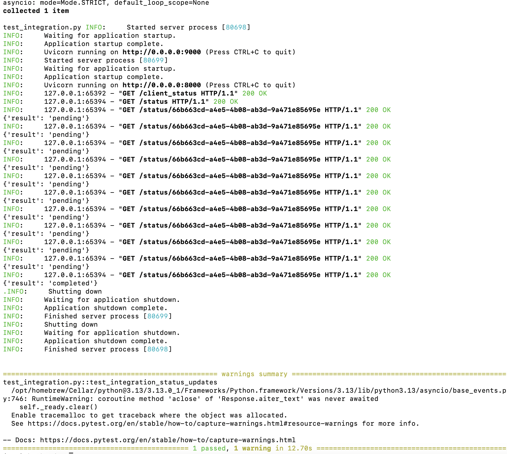
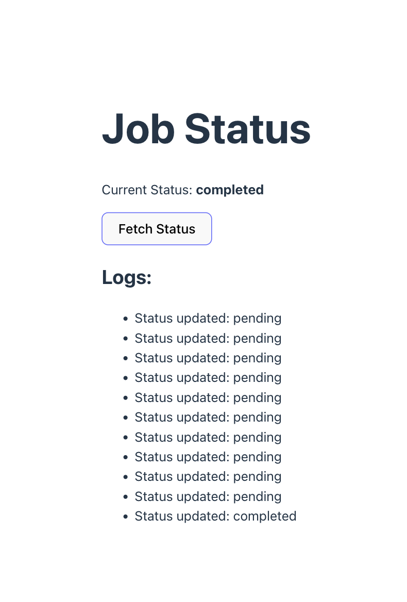

# SSE Job Status Application

## Prerequisites

### System Requirements

- Python 3.8+

## Project Structure

```
backend/
│
├── server.py           # Main server library handling job creation and status
├── client_library.py   # SSE wrapper library for streaming job status
├── requirements.txt    # Project dependencies
└── test_integration.py # Integration test

frontend/
│
└──src/App.jsx         # Frontend demo using the client library

README.md           # This documentation file
```

## Installation

### 1. Clone the Repository

```bash
git clone <repository-url>
```

### 2. Create a Virtual Environment

```bash
cd backend
python3 -m venv env
source env/bin/activate
```

### 3. Install Dependencies

```bash
# Install dependencies from requirements.txt
pip install -r requirements.txt
```

## Run integration test

### this will spins up the server, uses client library to demonstrate the usage and print logs.

pytest test_integration.py -s

```bash
cd backend
pytest test_integration.py -s
```

## Run the Application

### Backend Setup

Navigate to the backend directory:

```bash
cd backend
```

#### 1. Start the Server Library

```bash
python3 server.py
```

- **Port**: 9000
- **Host**: 0.0.0.0
- **Reload Mode**: Enabled

#### 2. Start the Client Library

```bash
python3 client_library.py
```

- **Port**: 8000
- **Host**: 0.0.0.0
- **Reload Mode**: Enabled

### Frontend Setup

Navigate to the frontend directory:

```bash
cd frontend
npm install
npm run dev
```

Access the application at: `http://localhost:5173/`

## Accessing Client Library (SSE) Endpoint

- **Base URL**: `http://localhost:8000`
- **GET `/client_status`**:
  - Server-Sent Events (SSE) endpoint that streams status updates until the connection closes
  - Avoids the need for repeated library calls
  - Streams real-time job status updates

### Message Format

Messages are sent in SSE format:

```
data: {"result": "<status>", "message": "<optional message>"}
```

## React Integration Example

Here's a sample React code to interact with the client library (full implementation in `frontend/src/App.jsx`):

```javascript
const connectToSSE = () => {
  // Close any existing SSE connection
  if (sseConnection) {
    sseConnection.close();
  }

  // Create a new SSE connection
  const eventSource = new EventSource("http://127.0.0.1:8000/client_status");

  eventSource.onmessage = (event) => {
    console.log(event.data);
    const rawData = event.data;
    const cleanData = rawData.startsWith("data:")
      ? rawData.slice(5).trim()
      : rawData;
    const jsonData = cleanData.replace(/'/g, '"');
    const data = JSON.parse(jsonData);

    // Update status and log
    setStatus(data.result);
    setLog((prevLog) => [...prevLog, `Status updated: ${data.result}`]);

    // Close the connection if the job is completed or errored
    if (data.result === "completed" || data.result === "error") {
      eventSource.close();
      setSseConnection(null);
    }
  };

  eventSource.onerror = (error) => {
    console.error("SSE connection error:", error);
    setLog((prevLog) => [...prevLog, "SSE connection error"]);
    eventSource.close();
    setSseConnection(null);
  };

  setSseConnection(eventSource);
};
```

## System Architecture


## Integration Test Result



## Front End Demo


